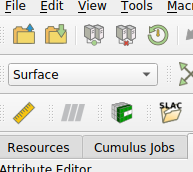

## Using CUBIT

Modelbuilder includes a toolbar icon to launch the CUBIT geometry
application.

.

To configure the icon, open the Settings dialog ("Preferences" in macOS)
and find the "ACE3P" tab. Set the path to the CUBIT executable on your
file system using the browse button next to the CUBIT field.
